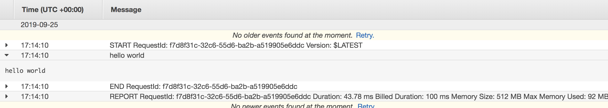
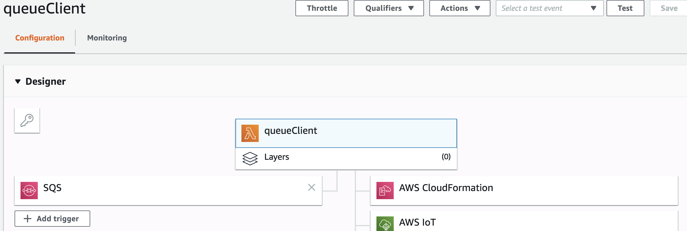

# SQS Message Queue
This is a command line app that sends a default hello world message to a given SQS Queue

# Installing and Running
* clone repo to local machine
* Open publisher and client directories in editor and insert queue urls into the switch
* Sending messages to a queue
  * cd into `publisher` directory
  * run `./gradlew run --args='a'`
  * that command sends the message to the a queue, you can also do `'b'` or `'c'` for the argument to send it to the b or c queue.
* Getting messages from a queue
  * cd into `client` directory
  * run `./gradlew run --args='a'`
  * that command gets a message grom the a queue, you can also do `'b'` or `'c'` for the argument to send it to the b or c queue.

## Lambda Functionality
The client code has been converted to Java and deployed to lambda

[Link to Java Directory](https://github.com/trevorjdobson/sqs/lambda-client)

## Cloudwatch

## Lambda

